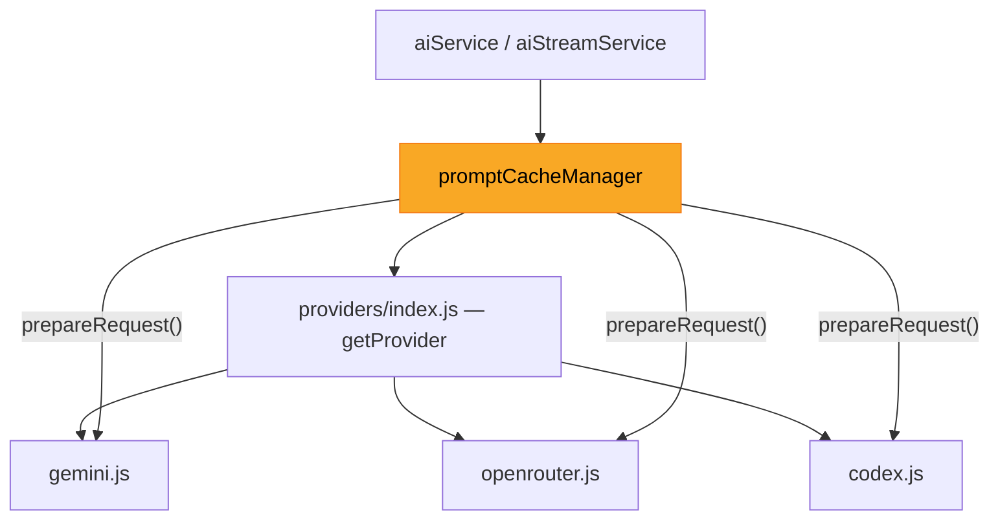

# Unified Prompt Caching Architecture

## Problem

Current caching is **Gemini-specific and broken**. You need a **provider-agnostic caching layer** so each provider manages its own prompt caching independently.

## Architecture



**Key idea:** Each provider implements an optional `prepareRequest(systemInstruction, prompt)` method that returns the optimal request body for that provider's caching mechanism. The `promptCacheManager` orchestrates this and provides unified logging/metrics.

## How Each Provider Caches Natively

| Provider | Native Caching Mechanism | How We Enable It |
|---|---|---|
| **Gemini** | Implicit caching via `systemInstruction` field (90% discount, automatic) | Use `systemInstruction` field instead of stuffing into `contents` |
| **OpenRouter** | Passes through to underlying model's caching (depends on model) | Keep `system` message as first message (already correct) |
| **Codex** | OpenAI automatic prompt caching (50% discount on cached prefix) | Keep `system` message as first message (already correct) |

> [!IMPORTANT]
> Each provider's native caching is **opt-in per provider**. The unified layer just ensures the `systemInstruction` is always separated from user content, so each provider can handle it optimally.

## Proposed Changes

### New Shared Cache Layer

#### [NEW] [promptCacheManager.js](file:///Users/szy/CascadeProjects/word-cursor/server/services/promptCacheManager.js)

Unified prompt cache manager that:

1. **Wraps provider calls** — ensures `systemInstruction` is always passed separately from `prompt`
2. **Provides cache stats logging** — unified `logCacheMetrics(provider, usageMetadata)` that each provider calls
3. **Exposes config** — reads `PROMPT_CACHE_LOG_HITS=true` from env to control cache-hit logging

```js
// Core interface:
module.exports = {
    logCacheMetrics(providerName, usage),  // unified cache-hit logging
    getCacheConfig(),                       // { logHits: bool }
};
```

---

### Gemini Provider (Critical Fix)

#### [MODIFY] [gemini.js](file:///Users/szy/CascadeProjects/word-cursor/server/services/providers/gemini.js)

1. **DRY up** — single [buildRequest(systemInstruction, prompt, { stream })](file:///Users/szy/CascadeProjects/word-cursor/server/services/providers/gemini.js#7-48) used by both [callAPI](file:///Users/szy/CascadeProjects/word-cursor/server/services/providers/gemini.js#49-89) and [callStreamAPI](file:///Users/szy/CascadeProjects/word-cursor/server/services/providers/openrouter.js#76-103)
2. **Use `systemInstruction` field** (enables implicit caching):
```diff
 const body = {
+    systemInstruction: { parts: [{ text: systemInstruction }] },
     contents: [{
         role: 'user',
-        parts: [{ text: systemInstruction + '\n\n' + prompt }]
+        parts: [{ text: prompt }]
     }],
 };
```
3. **Remove broken `cachedContent` logic** (the `GEMINI_ENABLE_CACHE` / `GEMINI_CACHED_CONTENT_NAME` blocks)
4. **Log cache metrics** via `promptCacheManager.logCacheMetrics()` using `cachedContentTokenCount` from response

---

### OpenRouter & Codex (No Changes Needed)

Both already use the correct pattern (`system` message first), which enables their respective native caching. Just add `logCacheMetrics()` call to surface cache stats.

#### [MODIFY] [openrouter.js](file:///Users/szy/CascadeProjects/word-cursor/server/services/providers/openrouter.js)
#### [MODIFY] [codex.js](file:///Users/szy/CascadeProjects/word-cursor/server/services/providers/codex.js)

Add `logCacheMetrics()` call in [parseSSEData](file:///Users/szy/CascadeProjects/word-cursor/server/services/providers/gemini.js#149-180) / [callAPI](file:///Users/szy/CascadeProjects/word-cursor/server/services/providers/gemini.js#49-89) response handling (same pattern as Gemini).

---

### Cleanup

#### [DELETE] [createCachedContent.js](file:///Users/szy/CascadeProjects/word-cursor/server/scripts/createCachedContent.js)
No longer needed — implicit caching is automatic.

#### [MODIFY] [.env](file:///Users/szy/CascadeProjects/word-cursor/server/.env) / [.env.example](file:///Users/szy/CascadeProjects/word-cursor/server/.env.example)
- Remove: `GEMINI_ENABLE_CACHE`, `GEMINI_CACHED_CONTENT_NAME`
- Add: `PROMPT_CACHE_LOG_HITS=true` (unified, provider-agnostic)

#### [MODIFY] [package.json](file:///Users/szy/CascadeProjects/word-cursor/server/package.json)
Remove `"create-cache"` script.

---

### Tests

#### [MODIFY] [geminiProvider.test.js](file:///Users/szy/CascadeProjects/word-cursor/server/__tests__/geminiProvider.test.js)
- Verify `systemInstruction` field is used (not stuffed into `contents`)
- Verify no `cachedContent` property in request body
- Test cache metrics logging

#### [NEW] [promptCacheManager.test.js](file:///Users/szy/CascadeProjects/word-cursor/server/__tests__/promptCacheManager.test.js)
- Test `logCacheMetrics` with various provider formats
- Test config reading

## Verification Plan

### Automated Tests
```bash
cd /Users/szy/CascadeProjects/word-cursor/server && npm test
```

### Manual Verification
Run server, make 2-3 requests, check logs for:
- `[Cache] gemini: X cached tokens (saved $Y)` after first warm-up request
